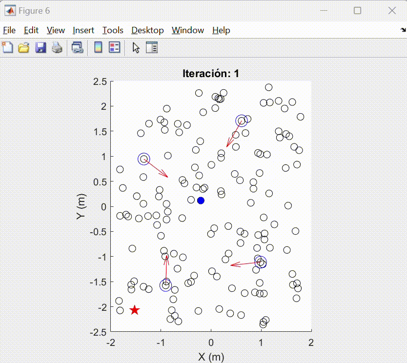

# _Modified Particle Swarm Optimization_ (MPSO)
### Experimento función optimización Schaffer 4
<br><div align="center">
    <br>
</div>

### Índice
- [MPSO_pololu_original.lxs](#mpso_pololu_originallxs)
- [MPSO_simulado.lxs](#mpso_simuladolxs)

### MPSO_pololu_original.lxs
El script **MPSO_pololu_original.lxs** contiene la implementación física del algoritmo de optimización _Particle Swarm Optimization_ (PSO) utilizando los robots diferenciales Pololu 3pi+ dentro del ecosistema Robotat. Este código se divide en tres partes: conexión al Robotat y a los robots pololu 3pi+, cálculo del algoritmo PSO y controlador PID.

Para establecer la conexión al Robotat se debe acceder a la red llamada _Robotat_. Se utiliza la función _robotat_connect_() la cual permite crear un objeto TCP con una ip y puerto específico. Al establecer la conexión con el Robotat, se procede a conectar los robots pololu 3pi+. Cada robot posee un ID (número de identificación), es importante mencionar que en este script se deben de utilizar los robots con ID consecutivo:

```matlab
first_agent = 2;     % first number of 3pi available
last_agent = 5;      % last number of 3pi available
Q_Agents = last_agent-first_agent+1;
```


- **Controlador PID**
    - Distancia entre ruedas: Se consideró la distancia entre las ruedas desde el punto de instalación.
    
    <br><div align="center">
        <br>
    </div>

    - Ángulo de rotación: Hace que el offset entre el eje del marker y el eje x+ del robot diferencial sea 0, alineando ambos ejes. Los ángulos de rotación se utilizan en grados.
    (imagen)
- **Radio de convergencia**
    Se definió este radio para medir si los agentes logran llegar a un área cercana a la meta. Si el radio es menor al radio máximo se considera que está dentro del área de convergencia y se detiene el algoritmo.

  <br><div align="center">
        <br>
    </div>
    

- **No colisiones entre los agentes robóticos**

Puedes encontrar el script en la carpeta _MPSO_pololu_original_.

### MPSO_simulado.lxs
El live script **MPSO_simulado.lxs** presenta la simulación del algoritmo MPSO con cierta cantidad de partículas. En este script puede definirse el objetivo o meta del enjambre.

**Experimento función de optimización meta**
<br><div align="center">
    <br>
</div>

## Webots 
- [PSO_simulacion_original.wbt](#PSO_simulacion_original.wbt)

### PSO_simulacion_original.wbt 
Este mundo contiene la simulación del algoritmo MPSO original utilizando el entorno _Webots_. La estructura de la simulación se muestra a continuación:

**Experimento función de costo Schaffer**
<br><div align="center">
    <br>
</div>

