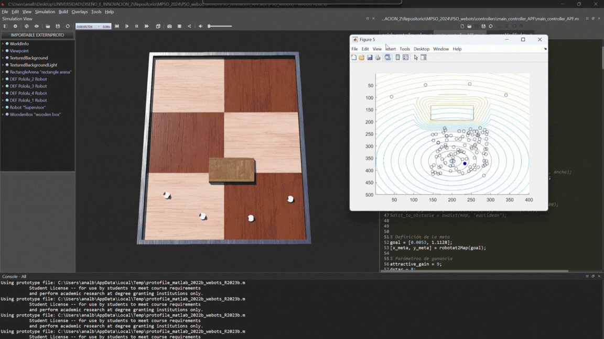
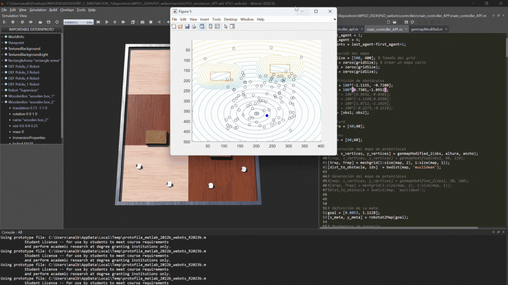
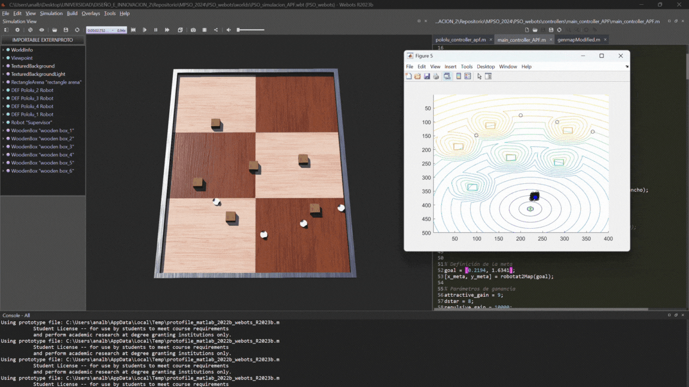

# MPSO implementando Campos potenciales Artificiales

### Índice
- [MPSO_APF_simulado](#mpso_apf_simulado)
- [MPSO_APF_pololu](#mpso_apf_pololu)

El método de campos potenciales artificiales consiste en implementar un campo de fuerza atractiva para la meta y campos de fuerza repulsivos para los obstáculos, con el fin de que los agentes robóticos sean atraídos hacia la meta, evitando colisionar con los obstáculos. Para eso se creó un mapa utilizando occupancy grid con las dimensiones del Robotat.

### MPSO_APF_simulado
El **MPSO_APF_simulado** presenta la simulación del algoritmo MPSO implementando campos potenciales artificiales para la evasión de obstáculos, con cierta cantidad de partículas. Es importante considerar que entre mayor sea la cantidad de partículas, el algoritmo encuentra más rápido las trayectorias libres de obstáculos.

**Experimento obstáculo rectangular con MPSO y APF**
 

     

### MPSO_APF_pololu
El **MPSO_APF_pololu** presenta el algoritmo PSO con campos artificiales potenciales modificado, para su funcionamiento con agentes robóticos Pololu 3pi+ y el ecosistema Robotat. Es importante mencionar que esta implementación se realiza en tiempo real, es decir, se calcula el algoritmo PSO y los campos potenciales al mismo tiempo que se encuentran las trayectorias libres de obstáculos.

**Experimento 1: Un obstáculo rectangular**
 

     

**Experimento 2: Dos obstáculos rectangulares**
 

     

**Experimento 3: Tres obstáculos rectangulares**
 

     

## Webots
- [PSO_simulacion_APF.wbt](#pso_simulacion_APFwbt)

### PSO_simulacion_APF.wbt
  Este mundo contiene la simulación del algoritmo PSO con campos potenciales artificiales para la evasión de obstáculos. Este algoritmo implementa cierta cantidad de partículas y agentes robóticos diferenciales. Al igual que la implementación en físico, este algoritmo calcula los campos artificiales y el algoritmo PSO al mismo tiempo que encuentra las trayectorias libres de obstáculos.

**Experimento 1: Un obstáculo rectangular**
 

     

**Experimento 2: Dos obstáculos rectangulares**
 

     

**Experimento 3: Tres obstáculos rectangulares**
 

     

**Experimento 3: Cuatro obstáculos rectangulares**
 

     

**Experimento 3: Seis obstáculos rectangulares**
 

     

