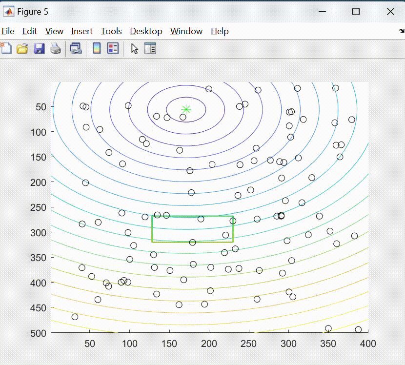

# MPSO implementando Campos Artificiales Potenciales

### Índice
- [MPSO_APF_simulado.lxs](#mpso_apf_simuladolxs)
- [MPSO_APF_pololu.lxs](#mpso_apf_pololulxs)

### MPSO_APF_simulado.lxs
El **MPSO_APF_simulado.lxs** presenta la simulación del algoritmo MPSO implementando campos potenciales artificiales para la evasión de obstáculos con cierta cantidad de partículas. Este script también incluye un planificador que determina la mejor trayectoria, con menor costo, encontrada por el enjambre mediante el PSO y los campos potenciales.

**Experimento obstáculo rectangular con MPSO y APF**
 

     

### MPSO_APF_pololu.lxs
El **MPSO_APF_pololu.lxs** presenta el algoritmo PSO con campos artificiales potenciales modificado, para su funcionamiento con agentes robóticos Pololu 3pi+ y el ecosistema Robotat.

## Webots
- [PSO_simulacion_APF.wbt](#PSO_simulacion_APF.wbt)

### PSO_simulacion_APF.wbt
  Este mundo contiene la simulación del algoritmo PSO con campos potenciales artificiales para la evasión de obstáculos. Este algoritmo implementa cierta cantidad de partículas y agentes robóticos diferenciales.

 

     

