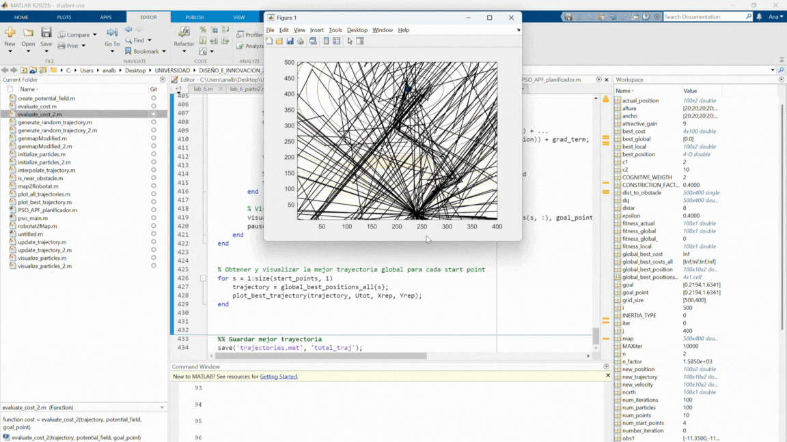
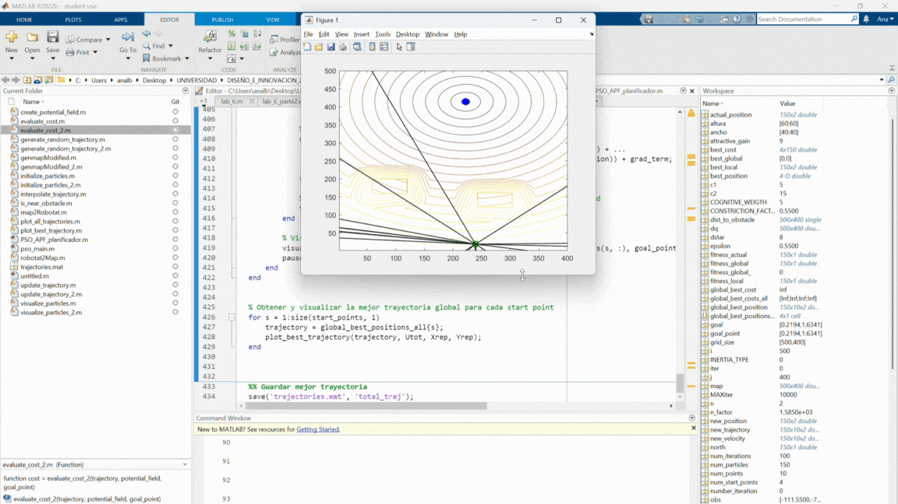
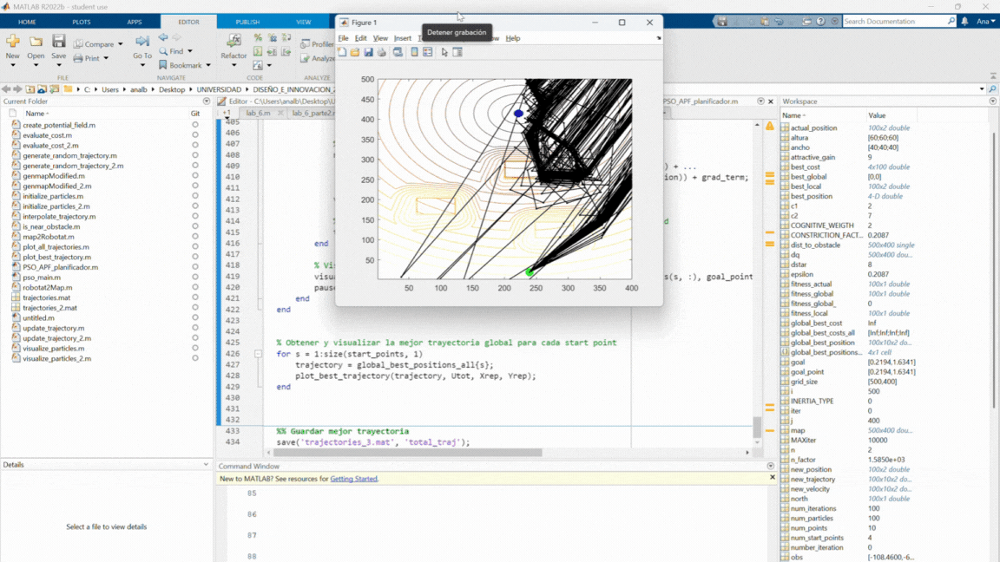
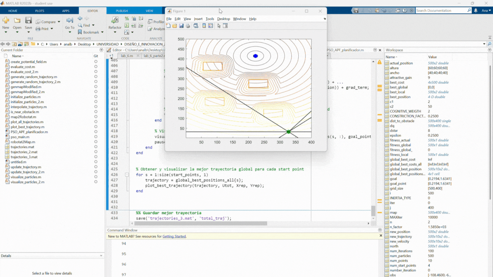
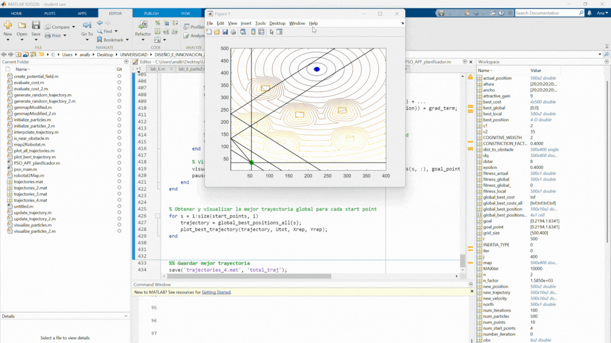
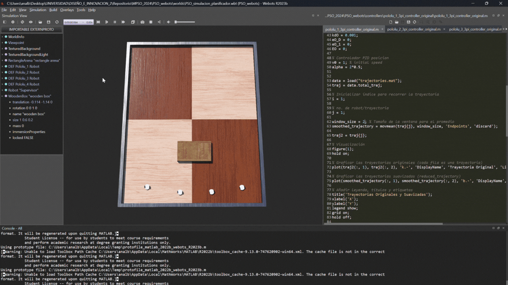

# PSO como planificador de trayectorias 

### Índice
- [PSO_APF_planificador.m](#pso_apf_planificadorm)
- [PSO_simulacion_planificador.wbt](#pso_simulacion_planificadorwbt)

## PSO_APF_planificador.m
Este script presenta la implementación del algoritmo PSO como planificador de trayectorias utilizando campos potenciales artificiales. Es importante mencionar que este planificador cálcula de primero las trayectorias libres de obstáculos para luego poder implementarlas en los agentes robóticos pololu 3pi+.

**Experimento 1: Un obstáculo rectangular**
 

     

**Experimento 2: Dos obstáculos rectangulares**
 

     

**Experimento 3: Tres obstáculos rectangulares**
 

     

**Experimento 4: Cuatro obstáculos rectangulares**
 

     

**Experimento 5: Seis obstáculos rectangulares**
 

     

## PSO_simulacion_planificador.wbt
En este mundo se implementan las trayectorias encontradas por el planificador por medio de un seguimiento de trayectoria utilizando un controlador PID y los agentes robóticos pololu 3pi+ en el entorno de simulación Webots.

**Experimento 1: Trayectorias encontradas por el planificador con un obstáculo rectangular**
 

     

