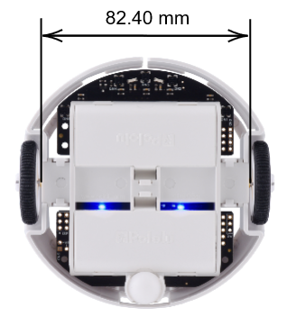
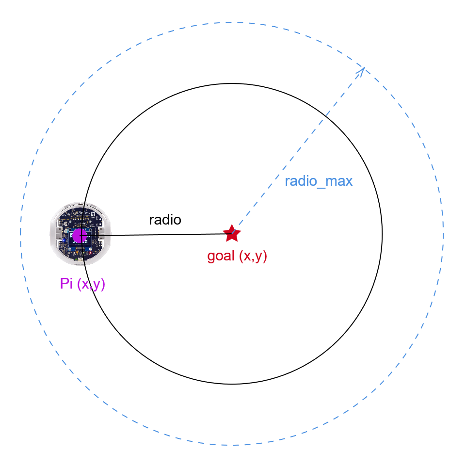
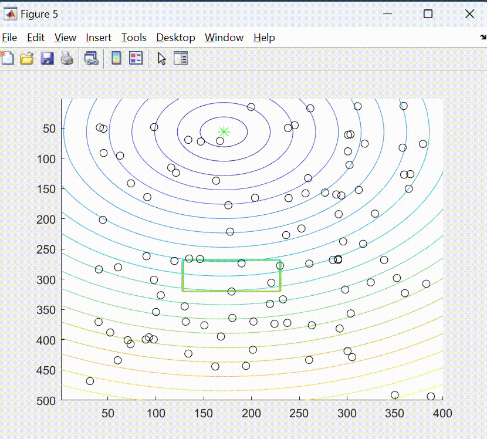

# Optimización del algoritmo de robótica de enjambre *Particle Swarm Optimization* para su implementación con agentes robóticos físicos en escenarios con obstáculos en el ecosistema Robotat 
A continuación, se muestra una guía de como utilizar el algoritmo MPSO modificado, con campos potenciales artificiales para la evasión de obstáculos en el ecosistema Robotat. Y las modificaciones que se realizaron para la optimización del mismo.

## Tabla de Contenidos
- [Videos demostrativos](#videos-demostrativos)
- [Códigos y guía de uso](#códigos_y_guía_de_uso)
- [Software y hardware](#software-y-hardware)
- [Información adicional](#información-adicional)

## Videos demostrativos
Al darle click a la imagen podrás ver una lista de videos sobre los experimentos realizados en la optimización del algoritmo MPSO y el funcionamiento del algoritmo PSO con campos potenciales artifiales para la evasión de obstáculos.

## Códigos y guía de uso
En la carpeta *Códigos* en OneDrive se encuentran los códigos principales que se utilizaron en esta tesis. A continuación, se da mayor detalle al funcionamiento y el uso de algoritmos.

### Matlab
- [MPSO_pololu_original.lxs](#MPSO_pololu_original.lxs)
- [MPSO_modified.lxs](#MPSO_modified.lxs)
- [MPSO_simulado.lxs](#MPSO_simulado.lxs)
- [MPSO_APF_simulado.lxs](#MPSO_APF_simulado.lxs)
- [MPSO_APF_pololu.lxs](#MPSO_APF_pololu.lxs)

### MPSO_pololu_original.lxs
El live script **MPSO_pololu_original.lxs** presenta un algoritmo de optimización llamado _Particle Swarm Optimization_ conocido por sus siglas como PSO, para encontrar la mejor posición de un enjambre de robots Pololu 3pi+, este live script explica de forma detallada cada parte del código. Es importante mencionar algunas modificaciones realizadas para el correcto funcionamiento del MPSO:

- **Controlador PID**
    - Distancia entre ruedas: Se consideró la distancia entre las ruedas desde el punto de instalación.
    
     

         
    

    - Ángulo de rotación: Hace que el offset entre el eje del marker y el eje x+ del robot diferencial sea 0, alineando ambos ejes. Los ángulos de rotación se utilizan en grados.
    (imagen)
- **Radio de convergencia**
    Se definió este radio para medir si los agentes logran llegar a un área cercana a la meta. Si el radio es menor al radio máximo se considera que está dentro del área de convergencia y se detiene el algoritmo.

   

         
    

    

- **No colisiones entre los agentes robóticos**

**Experimento función optimización Schaffer 4**
 

     

Puedes encontrar el script en la carpeta _MPSO_pololu_original_ 

### MPSO_modified.lxs
El live script **MPSO_modified.lxs** presenta las modificaciones que se realizaron al algoritmo MPSO, utilizando vectorización para el cálculo de la función de costo, el factor de incercia y el controlador PID.

### MPSO_simulado.lxs
El live script **MPSO_simulado.lxs** presenta la simulación del algoritmo MPSO con cierta cantidad de partículas. En este script puede definirse el objetivo o meta del enjambre.

**Experimento función de optimización meta**
 

     

### MPSO_APF_simulado.lxs
El **MPSO_APF_simulado.lxs** presenta la simulación del algoritmo MPSO implementando campos potenciales artificiales para la evasión de obstáculos con cierta cantidad de partículas. Este script también incluye un planificador que determina la mejor trayectoria, con menor costo, encontrada por el enjambre mediante el PSO y los campos potenciales.

**Experimento obstáculo rectangular con MPSO y APF**
 

     

### MPSO_APF_pololu.lxs
El **MPSO_APF_pololu.lxs** presenta el algoritmo PSO con campos artificiales potenciales modificado, para su funcionamiento con agentes robóticos Pololu 3pi+ y el ecosistema Robotat.

### Webots 
- [PSO_simulacion_original.wbt](#PSO_simulacion_original.wbt)
- [PSO_simulacion_APF.wbt](#PSO_simulacion_APF.wbt)
- [PSO_simulacion_4.wbt](#PSO_simulacion_4.wbt)

### PSO_simulacion_original.wbt 
Este mundo contiene la simulación del algoritmo MPSO original utilizando el entorno _Webots_. La estructura de la simulación se muestra a continuación:

**Experimento función de costo Schaffer**
 

     

### PSO_simulacion_4.wbt
Este mundo contiene la simulación del algoritmo MPSO implementando un controlador PID vectorizado.

### PSO_simulacion_APF.wbt
Este mundo contiene la simulación del algoritmo PSO con campos potenciales artificiales para la evasión de obstáculos. Este algoritmo implementa cierta cantidad de partículas y agentes robóticos diferenciales.

 

     

## Software y hardware
**Matlab**

**Webots**

## Información adicional
Información adicional del proyecto...

