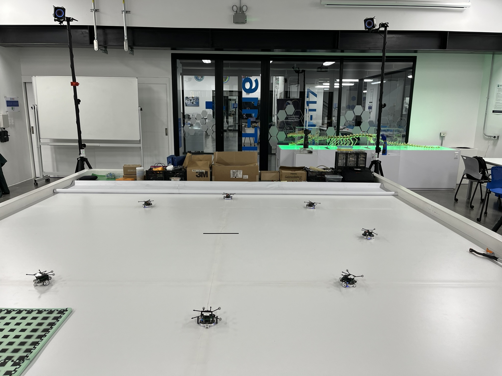
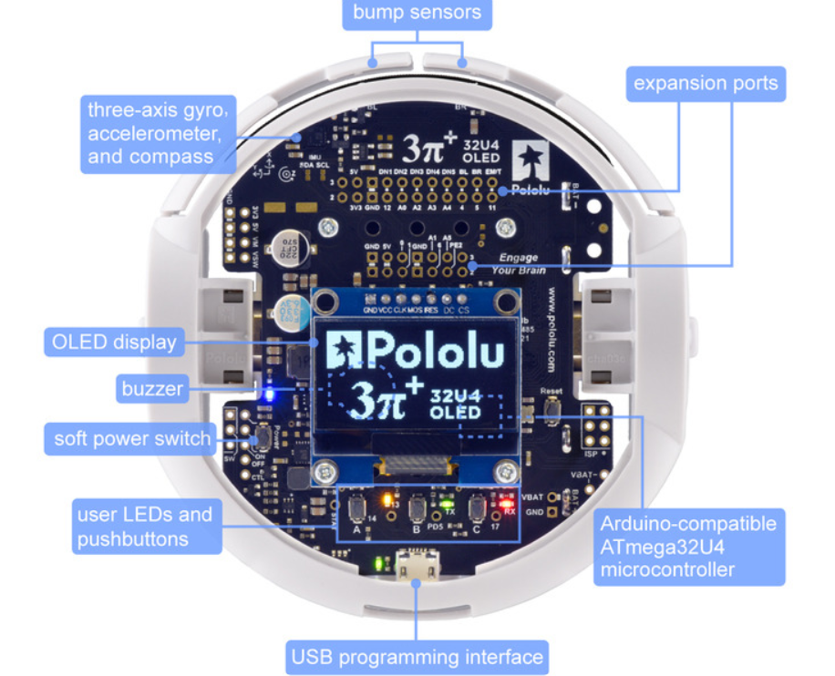

# Optimización del algoritmo de robótica de enjambre *Particle Swarm Optimization* para su implementación con agentes robóticos físicos en escenarios con obstáculos en el ecosistema Robotat 
El algoritmo PSO se inspira en el comportamiento colectivo de ciertos animales para localizar alimento, este permite la colaboración en grupo para alcanzar un objetivo en común. A continuación, se presenta una optimización del algoritmo PSO mediante técnicas de vectorización, paralelización y migración al lenguaje de programación Python, así como su implementación con campos artificiales potenciales para la evasión de obstáculos y la creación de un planificador de trayectorias.

## Tabla de Contenidos
- [Videos demostrativos](#videos-demostrativos)
- [Códigos](#códigos)
- [Software y hardware](#software-y-hardware)
- [Información adicional](#información-adicional)

## Videos demostrativos
Al darle click en la imagen, se podrá acceder a una lista de videos que muestran los experimentos realizados en la optimización del algoritmo MPSO, los experimentos del algoritmo PSO con campos potenciales artifiales para la evasión de obstáculos y el planificador de trayectorias.

 

    

## Códigos
### Algoritmo MPSO 
El algoritmo _Particle Swarm Optimization_ conocido por sus siglas como PSO, es un método de optimización que utiliza un enjambre de partículas para encontrar la mejor trayectoria hacia una meta en específico. El algoritmo _Modified Particle Swarm Optimization_ (MPSO) fue adaptado para implementar el PSO con agentes robóticos físicos, específicamente los robots pololu 3pi+, dentro del ecosistema Robotat. 

[Ver documentación](MPSO.md)

### Algoritmo MPSO vectorizado
Se realizaron varias mejoras al algoritmo MPSO, comenzando con la incorporación de la vectorización en el código. La implementación del controlador PID se modificó para que funcionara de forma vectorial, sin la necesidad de ciclos for. Además, se añadió vectorización al cálculo de la función de costo y al parámetro de inercia del PSO. 

[Ver documentación](MPSO_vec.md)

### Algoritmo MPSO migrado a Python
Otra mejora que se realizó al algoritmo MPSO, fue la migración al lenguaje de programación Python, posterior a eso se implementó paralelización con Python para evaluar si el rendimiento del algoritmo era mejor.

### Algoritmo PSO con Campos potenciales artificiales
El algoritmo PSO mejorado implementa la técnica de campos potenciales artificiales para la evasión de obstáculos. El algoritmo PSO dirige al enjambre de robots pololu 3pi+, en el cual los robots son atraídos hacia la meta mediante el campo atractor y evitan los obstáculos debido a la fuerza repulsiva del campo repulsor. Es importante mencionar que este algoritmo encuentra las trayectorias libres de obstáculos en tiempo real.

[Ver documentación](MPSO_APF.md)

### Algoritmo PSO como planificador de trayectorias
El algoritmo PSO fue implementado como planificador de trayectorias con el fin de comparar su rendimiento con el algoritmo PSO con campos potenciales artificiales en tiempo real. Este también implementa campos potenciales artificiales, pero la diferencia es el tiempo en que tarda en encontrar las trayectorias libres de obstáculos.

### Software y hardware
**Software**
  Los programas utilizados para el desarrollo de los algoritmos fueron Matlab y Webots. Las versiones utilizadas se presentan en la siguiente tabla: 

| **Matlab** | **Webots** | 
|--------|--------|
| R2022b | 2023b  | 

Los experimentos se realizaron utilizando la computadora Lenovo Legion 5 16IRX9 con las siguientes especificaciones:

|**Especificaciones**| 
|--------------------|
| Intel Core i7-14650HX |
| NVIDIA Geforce RTX 4060 |
| Memoria RAM 16 GB |
| Disco duro 500 GB |

**Hardware**
  El hardware que se utilizaron fueron los agentes robóticos pololu 3pi+, las cámaras de movimiento OptiTrack y la plataforma del Robotat.

 

     

## Información adicional
- Celular: 30021157
- Correo eléctronico: analbflores2001@gmail.com
 

